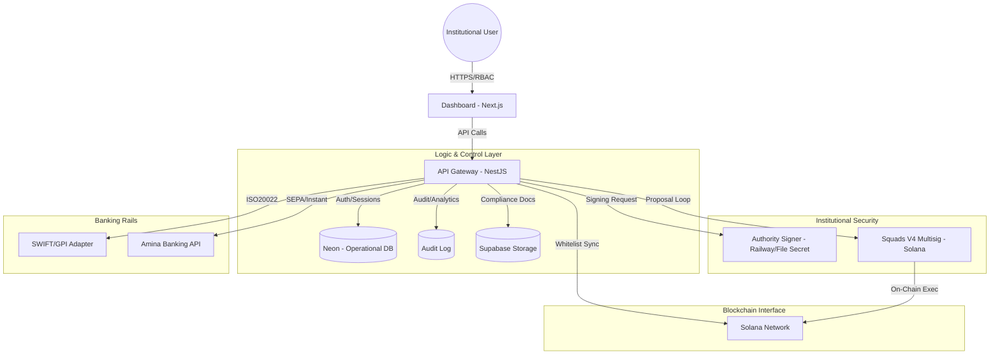

# TreasuryOS Technical Architecture

Institutional Digital Asset Treasury Gateway. Built for Solana with Compliance-First Infrastructure.

## 1. High-Level System Design

TreasuryOS is architected as a modular, three-tier system designed to bridge traditional institutional controls with decentralized asset management.

### Architecture Overview

## 2. Core Modules

### 2.1 API Gateway (`apps/api-gateway`)
The central entry point for all institutional commands.
- **Vercel Optimized**: Built as a stateless NestJS application optimized for Serverless execution.
- **Identity Control**: Integrated with JWT-based RBAC and session persistence in Neon/Supabase.
- **Authority Signer**: Loads the Solana authority from Railway-injected secret material or a mounted keypair file for on-chain operations.

### 2.2 Solana Programs (`programs/`)
On-chain logic enforcing compliance at the protocol level.
- **Compliance Registry**: An on-chain directory of institutional entities and their current risk scores.
- **Wallet Whitelist**: Automatically enforces that only KYC'd wallets can interact with the TreasuryOS managed vaults.
- **Transaction Monitor**: Real-time event logging of all treasury operations.

### 2.3 Dashboard (`apps/dashboard`)
The administrative interface for Treasury Managers and Compliance Officers.
- **Real-time Monitoring**: Integrated with Solana RPCs for live balance tracking.
- **Case Management**: Structured workflow for KYC reviews, manual transaction overrides, and audit reporting.

## 3. The Institutional Security Model

TreasuryOS employs a **Defense-in-Depth** strategy:

1.  **Transport Security**: Cloudflare WAF + mTLS for origin protection.
2.  **Key Management**: Signing material is injected through platform secret managers or mounted signer files instead of being committed to the repository.
3.  **Governance Enforcement**: High-value transactions require $n$-of-$m$ on-chain multisig approval via Squads V4.
4.  **Compliance Interceptor**: Every transaction is screened against the Registry before signing is authorized.

## 4. Deployment Strategy

- **Compute**: Vercel (Frontend) + Railway (API Gateway).
- **Database**: Neon (High-concurrency API state).
- **Storage**: Supabase (Compliance documents and artifact hosting).
- **Secrets**: Railway Variables + Vercel Environment Variables.
- **Observability**: Manifest + Sentry for error tracking.
