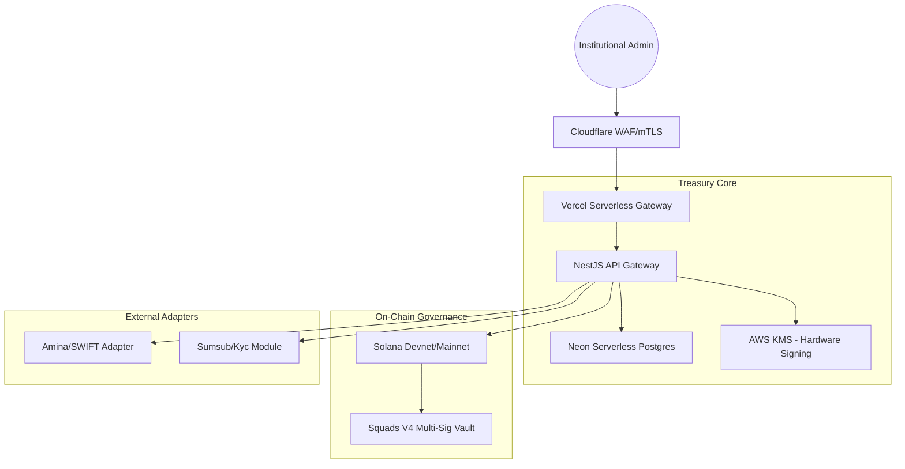

# TreasuryOS 🏛️

**Institutional-Grade Digital Asset Treasury & Compliance Operating System.**

TreasuryOS is a comprehensive platform designed for regulated financial institutions (CASPs, Banks, Family Offices) to manage multi-chain treasury operations with institutional security, on-chain governance, and automated compliance.

---

## 🏛️ Architecture Overview

TreasuryOS leverages a "Defense-in-Depth" architecture combining serverless scalability with hardware-backed security.



---

## ✨ Key Features

- **Institutional Security**: Hardware-backed Ed25519 signing using **AWS KMS**. No private keys ever touch the server memory.
- **On-Chain Governance**: Integrated with **Squads V4**. High-value operations trigger multisig transaction proposals rather than direct execution.
- **Automated Compliance**: Real-time screening and "Travel Rule" compliance registry integrated directly into the transaction lifecycle.
- **Serverless Performance**: Optimized for **Vercel** with **Neon.tech** connection pooling to handle high-frequency institutional traffic.
- **Institutional Banking**: ISO20022/SWIFT relay support for fiat-to-crypto reconciliation (Work-in-Progress).

---

## 🚀 Deployment Guide

TreasuryOS is architected for a serverless-first production rollout.

### 1. Database (Neon)
Provision a **Neon.tech** PostgreSQL instance.
- Use the **Pooled** connection string (ends in `.pooler.neon.tech`).
- Set `DATABASE_SSL=true`.

### 2. Backend (Vercel)
The API Gateway is pre-configured for Vercel Serverless Functions.
- Run `npm run build` in the root.
- Deploy via the Vercel CLI or Dashboard.
- Ensure `FRONTEND_URL` and `API_GATEWAY_PORT` are set in Vercel environment variables.

### 3. Hardware Signing (AWS KMS)
- Provision an **Ed25519 Asymmetric Key** in AWS KMS.
- Assign an IAM role to the Vercel function with `kms:Sign` and `kms:GetPublicKey` permissions.
- Configure `AWS_KMS_KEY_ID` and `SOLANA_SIGNING_MODE=kms`.

### 4. Edge Security (Cloudflare)
- Point your treasury domain to Cloudflare.
- Enable **Full (Strict) SSL**.
- Configure a **WAF Policy** to restrict access to known Institutional IP ranges or require **mTLS Client Certificates**.

---

## 🛠️ Local Development

### Prerequisites
- Node.js 20+
- Solana CLI
- Docker (for local Redis/Postgres testing)

### Setup
1. Clone the repository:
   ```bash
   git clone https://github.com/Web3-Platforms/TreasuryOS.git
   ```
2. Install dependencies:
   ```bash
   npm install
   ```
3. Set up environment:
   ```bash
   cp .env.example .env
   ```
4. Start the development cluster:
   ```bash
   npm run dev
   ```

---

## ⚖️ License
This project is licensed under the **MIT License**. See [LICENSE](file:///LICENSE) for details.

---

## 🔒 Security Policy
Institutional users should refer to our [Security Hardening Guide](file:///CLOUDFLARE_SECURITY_HARDENING.md) before managing real funds. For vulnerability disclosures, please contact security@web3-platforms.com.
